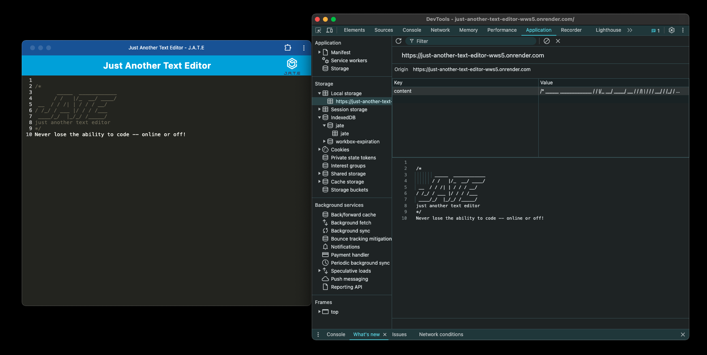

# just-another-text-editor

## Description
A Progressive Web Application text editor that can be used online or offline to write code or take notes.  This application uses redundant methods to keep you productive regardless of circumstance: local storage AND and indexDB database.  Built using a variety of webpack plugins:

* **HtmlWebpackPlugin** to automatically generate an HTML file to be included in the bundled assets

* **MiniCssExtractPlugin** to extract CSS files and bundle seperately. 

* **InjectManifest** to inject a custom service worker to handle caching and retrieving cached data.

* **WebpackPwaManifest** to generate a manifest.json file

## Table of Contents
* [Installation](#installation)
* [Usage](#usage)
* [License](#license)
* [Contributing](#contributing)
* [Credits](#credits)
* [Tests](#tests)
* [Questions](#questions)

## Installation
Installation instructions for application:
npm i

## Usage
Click [here](https://just-another-text-editor-wws5.onrender.com/) for deployed application.

To use this application, navigate to the link above to view the deployed application.  From there you can instantly start typing and your work will automatically be saved.  If you're going to be offline and would like to continue to work, click the install button, and you'll see the PWA icon in the search bar, allowing you to download the application locally and experience J.A.T.E wherever you and your computer are!

## License
This project is operating under the MIT license.  For more detailed information, please click [here](https://opensource.org/license/mit).

## Contributing
See my contact information below and reach out with any queries

## Credits
N/A

## Tests
To run tests for the application:
N/A

## Questions
Contact me for any questions regarding this project:

GitHub: [lindsay-terry](https://github.com/lindsay-terry)

Email: lindsaytee66@gmail.com
